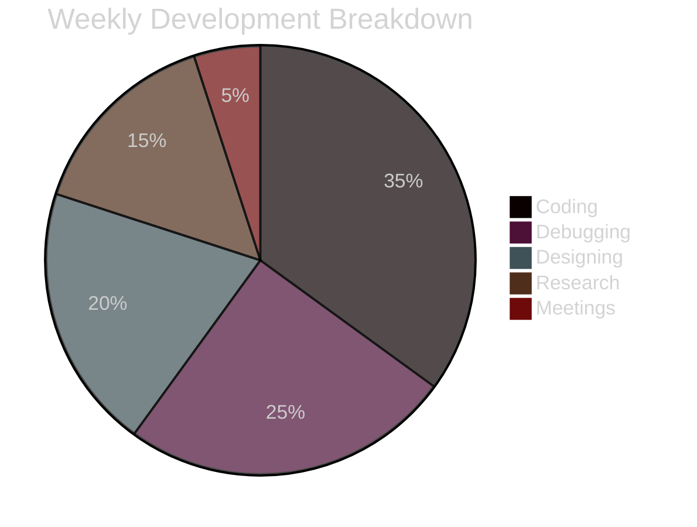

## 👋 Hello, I’m Panagiotis  

---

  

> **"**
> **Beneath this mask there is more than flesh.**  
> **Beneath this mask there is an idea, Mr. Creedy.**  
> **And ideas are bulletproof.🔥**
> **"**

        

### 📫 How to Reach Me  
          

---
<!-- Dynamic Animated Header -->

  
  <h1 align="center">🚀 Full-Stack Developer | Tech Enthusiast</h1>

---

<!-- GitHub Stats & Trophies -->

  
  
  
  
  

## 🛠️ Tech Stack & Tools

<table align="center">
  <tr>
    <td><b>Frontend</b></td>
    <td><b>Backend</b></td>
    <td><b>Databases</b></td>
    <td><b>DevOps & Cloud</b></td>
  </tr>
  <tr>
    <!-- Frontend -->
    <td>
      
      
      
    </td>
    <!-- Backend -->
    <td>
      
      
      
    </td>
    <!-- Databases -->
    <td>
      
      
    </td>
    <!-- DevOps -->
    <td>
      
      
      
    </td>
  </tr>
</table>
---

<!-- Activity Graph -->
## 📈 Coding Activity

<!-- PROJECT SHOWCASE -->
🚀 Featured Creations
Project	Description	Tech Stack	Demo
Cloud Dashboard	Real-time infrastructure monitoring	AWS React GraphQL	Live Demo
E-Commerce API	Microservices architecture	Node.js MongoDB Redis	Docs
<!-- SOCIAL LINKS -->
🌐 Let's Collaborate

LinkedIn
Twitter
Dev.to
Hashnode

<!-- FUN SECTION -->
⚡️ Code & Coffee

Lines of Code
Code Time

javascript

const develop = async () => {
  while(true) {
    await code();
    drinkCoffee();
    debug();
  }
}

<!-- FOOTER -->

Profile Views
GitHub Followers

"First, solve the problem. Then, write the code." - John Johnson

 
