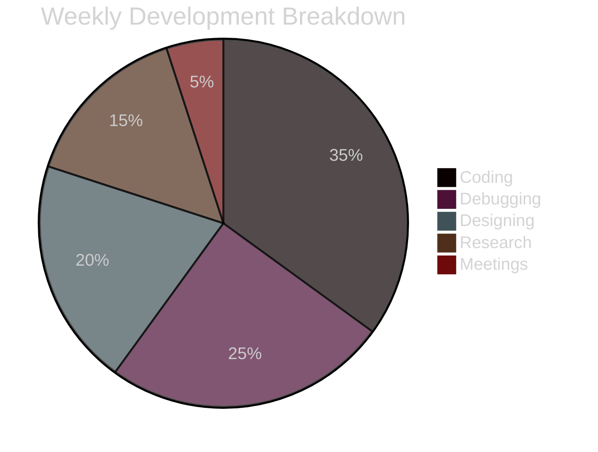

## 👋 Hello, I’m Panagiotis Kotsorgios  
**Full-Stack Developer** with expertise in modern web design, low-level systems, and open-source contributions.  

---

:cite[1]:cite[3]

> **"Beneath this mask there is more than flesh.**  
> **Beneath this mask there is an idea, Mr. Creedy.**  
> **And ideas are bulletproof."**
> 
> ― <cite>V, _V for Vendetta_</cite>  
> 🎭 ⚡ 🔥

  

---

### 🔍 More About V
- **Origin**: From Alan Moore's revolutionary graphic novel [V for Vendetta](https://www.goodreads.com/book/show/5805.V_for_Vendetta) :cite[1]
- **Symbolism**: Represents anarchism vs fascism through Guy Fawkes imagery :cite[2]:cite[7]
- **Legacy**: Adopted by digital activists worldwide as a symbol of protest :cite[4]:cite[7]

### 📫 How to Reach Me  
      

### ⚡ Fun Fact  
I speak **binary** fluently—sometimes I only program the 0s!  

---

## - `A well-played game of chess is a sign of a gentleman`. 
## - `A perfectly played one is a sign of a wasted life`.

|     | **A** | **B** | **C** | **D** | **E** | **F** | **G** | **H** |
|:---:|:-----:|:-----:|:-----:|:-----:|:-----:|:-----:|:-----:|:-----:|
| **8** | ♜     | ♞     | ♝     | ♛     | ♚     | ♝     | ♞     | ♜     |
| **7** | ♟     | ♟     | ♟     | ♟     | ♟     | ♟     | ♟     | ♟     |
| **6** |       |       |       |       |       |       |       |       |
| **5** |       |       |       |       |       |       |       |       |
| **4** |       |       |       |       |       |       |       |       |
| **3** |       |       |       |       |       |       |       |       |
| **2** | ♙     | ♙     | ♙     | ♙     | ♙     | ♙     | ♙     | ♙     |
| **1** | ♖     | ♘     | ♗     | ♕     | ♔     | ♗     | ♘     | ♖     |

---
<!-- Dynamic Animated Header -->

  
  <h1 align="center">🚀 Full-Stack Developer | Tech Enthusiast</h1>

---

<!-- GitHub Stats & Trophies -->

  
  
  
  
  
  

---

<!-- Tech Stack Section -->
## 🛠️ Tech Stack & Tools

### **Frontend**

### **Backend**

### **Databases**

### **DevOps & Cloud**

---

<!-- Activity Graph -->
## 📈 Coding Activity

<!-- PROJECT SHOWCASE -->
🚀 Featured Creations
Project	Description	Tech Stack	Demo
Cloud Dashboard	Real-time infrastructure monitoring	AWS React GraphQL	Live Demo
E-Commerce API	Microservices architecture	Node.js MongoDB Redis	Docs
<!-- SOCIAL LINKS -->
🌐 Let's Collaborate

LinkedIn
Twitter
Dev.to
Hashnode

<!-- FUN SECTION -->
⚡️ Code & Coffee

Lines of Code
Code Time

javascript

const develop = async () => {
  while(true) {
    await code();
    drinkCoffee();
    debug();
  }
}

<!-- FOOTER -->

Profile Views
GitHub Followers

"First, solve the problem. Then, write the code." - John Johnson

 
